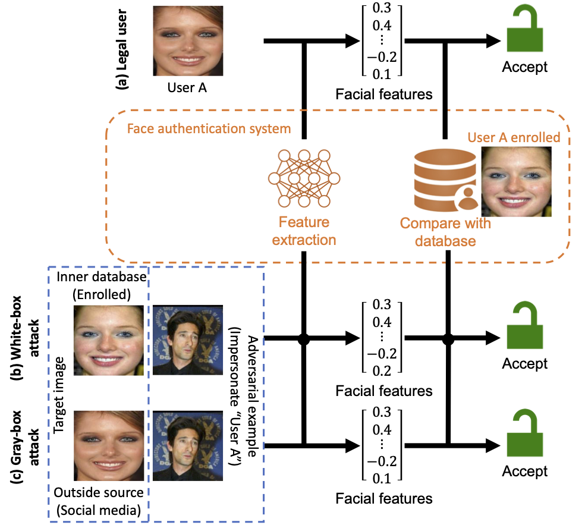

# Similarity-based Gray-box Adversarial Attack Against Deep Face Recognition

Hanrui Wang<sup>1</sup>, Shuo Wang<sup>2</sup>, Zhe Jin<sup>3</sup>, Yandan Wang<sup>4</sup>, Cunjian Chen<sup>5</sup>, Massimo Tistarelli<sup>6</sup>

[pdf](https://arxiv.org/pdf/2201.04011)

The majority of adversarial attack techniques perform well against deep face recognition when the full knowledge of the system is revealed (white-box). However, such techniques act unsuccessfully in the gray-box setting where the face templates are unknown to the attackers. In this work, we propose a similarity-based gray-box adversarial attack (SGADV) technique.



****
## Contents
* [Main Requirements](#Main-Requirements)
* [Data Preparation](#Data-Preparation)
* [Pretrained Models](#Pretrained-Models)
* [Usage](#Usage)
* [Results](#Results)
* [Citation](#Citation)
* [Acknowledgement](#Acknowledgement)
* [Contacts](#Contacts)
****

## Main Requirements

  * **Python (3.9.13)**
  * **torch (1.13.1+cu116)**
  * **torchvision (0.14.1+cu116)**
  * **eagerpy (0.30.0)**
  
  The versions in `()` have been tested.

## Data Preparation

Source image name must satisfy `00000_0.jpg`. `00000` and `_0` indicates the image id and user id/class/label, respectively. The image id must be unique and auto-increment from `00000`. `.jpg` can be any image file format.

20 source samples have been prepared for the [demo](#Usage).

## Pretrained Models

* [InsightFace](https://github.com/deepinsight/insightface): iresnet100 pretrained using the CASIA dataset; automatically downloaded

* [FaceNet](https://github.com/timesler/facenet-pytorch): InceptionResnetV1 pretrained using the VggFace2 dataset; automatically downloaded

## Usage
Run attack: SGADV.py

Objective function: foolbox/attacks/gradient_descent_base.py

New developed tools: foolbox/utils.py

Filter objects of CelebA: tools/fetch_celebAhq.py

Feature embeddings and save to .mat: tools/feature_embedding.py


## Results

### Attack success rate / False acceptance rate (%)
* The security $FAR_{attack}$ is improved.

| Defense | $FAR_{SGADV}$ (seen) | $FAR_{FGSM}$ | $FAR_{PGD}$ | $FAR_{CW}$ | $FAR_{DI^2-FGSM}$ | $FAR_{TI-FGSM}$ | $FAR_{LGC}$ | $FAR_{BIM}$ |
|:---:|:----:|:-----:|:-----:|:-----:|:-----:|:-----:|:-----:|:-----:|
| Insightface | 100.0 | 100.0 | 100.0 | 100.0 | 95.00 | 93.17 | 93.73 | 91.50 |
| IWMF | 6.2 | 16.2 | 1.0 | 0.0 | 4.63 | 6.27 | 3.37 | 1.17 |
| IWMF-Diff | 3.2 | 15.6 | 0.8 | 0.2 | 28.53 | 33.00 | 23.97 | 10.87 |

### Authentication accuracy / False rejection rate (%)
* The authentication accuracy $FRR_{genuine}$ is preserved.
* The robustness of classifying adversarial examples as their true labels $FRR_{attack}$ is improved.

| Defense | $FRR_{genuine}$ | $FRR_{SGADV}$ (seen) | $FRR_{FGSM}$ | $FRR_{PGD}$ | $FRR_{CW}$ |
|:---:|:----:|:-----:|:-----:|:-----:|:-----:|
| Insightface | 0.28 | 98.30 | 6.34 | 51.92 | 42.12 |
| IWMF | 6.36 | 25.50 | 19.58 | 17.38 | 13.08 |
| IWMF-Diff | 3.22 | 12.06 | 8.28 | 9.22 | 6.18 |

## Citation
If using this project in your research, please cite our paper.
```
@inproceedings{wang2021similarity,
  title={Similarity-based Gray-box Adversarial Attack Against Deep Face Recognition},
  author={Wang, Hanrui and Wang, Shuo and Jin, Zhe and Wang, Yandan and Chen, Cunjian and Tistarelli, Massimo},
  booktitle={2021 16th IEEE International Conference on Automatic Face and Gesture Recognition (FG 2021)},
  pages={1--8},
  year={2021},
}
```

## Acknowledgement
* The code in the folder *foolbox* is derived from the project [foolbox](https://github.com/bethgelab/foolbox).

* Images in the folder *data* are only examples from [LFW](http://vis-www.cs.umass.edu/lfw/) and [CelebA](https://mmlab.ie.cuhk.edu.hk/projects/CelebA.html) dataset.

## Contacts
If you have any questions about our work, please do not hesitate to contact us by email.

Hanrui Wang: hanrui_wang@nii.ac.jp
